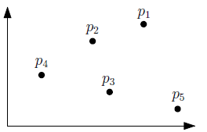

# dominating-points
In 2D, each point has (x, y) coordinates. A point P1 = (x1,y1) will dominate another point P2 = (x2,y2) if x1 > x2 AND y1 > y2.  

This program uses a divide and conquer algorithm on a set of points to assign a value to each point. This value is based on the number of other points which they 'dominate'. This solution is also extended to 3D, where a point has (x,y,z) coordinates.  

In the above example, p1 has a value of "3", since it dominates p2, p3, and p4.

Input is taken line-by-line from stdin.  
Input format:  
>n  
p1(x) p1(y)  
p2(x) p2(y)  
...  
pn(x) pn(y)  

Input explanation:
- Define the number of points, "n".
- List the x and y coordinates of each point, one point per line.

Output:  
For each point, output the number of points that they dominate.  

An example of valid input (n10_0.in) and expected output (n10_0.out) is provided in the repo.
